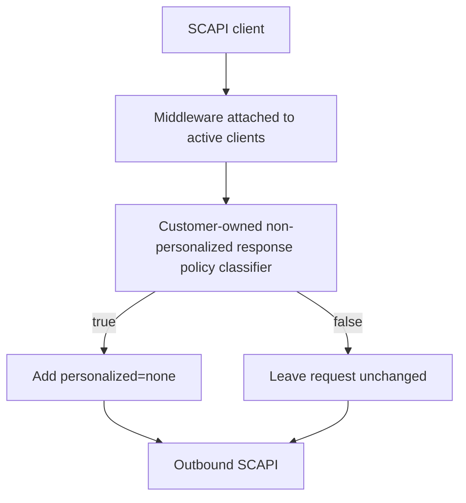

# SCAPI Non-Personalized Responses

SCAPI caches eligible `GET` responses in [a web-tier cache and a CDN cache](https://developer.salesforce.com/docs/commerce/commerce-api/guide/server-side-web-tier-caching.html). The CDN cache is implicit. With page caching enabled, the two caches operate automatically.

The [`personalized=none` parameter](https://developer.salesforce.com/docs/commerce/commerce-api/guide/server-side-web-tier-caching.html#the-personalizednone-query-parameter) is an explicit instruction. It tells SCAPI to treat the request as non-personalized. SCAPI then skips Shopper Context and suppresses hook personalization, including `setVaryBy`.

SCAPI does not have full knowledge of customer customizations. Hooks, custom fields, custom headers, overrides, and custom APIs can change a response. Thus, use `personalized=none` only when all shoppers can safely receive the same response.

## Prerequisites

To use SCAPI caching with Storefront Next's automatic non-personalized response classification:

- Storefront Next version 1.4.0 or later. See [storefront-next-template](https://github.com/SalesforceCommerceCloud/storefront-next-template) GitHub repository.
- B2C Commerce 26.9 or later.
- [Enable page caching](https://developer.salesforce.com/docs/commerce/commerce-api/guide/server-side-web-tier-caching.html#enable-caching) for the site in Business Manager. Classification alone doesn't enable caching.

## Central Classification

Previously, a customer could add `personalized=none` to each SCAPI call. This method puts the safety decision in many call sites. The decisions can be inconsistent or become out of date.

Storefront Next now puts this decision in one [server policy](../src/lib/scapi/non-personalized-response-policy.server.ts). It examines each final SCAPI request. A final request is the request after Storefront Next applies defaults, serializes parameters, and runs its request middleware. The final query is the serialized query in that request. Middleware adds `personalized=none` only when the policy returns `true`.



This classification does not enable caching. It does not select a cache time-to-live. It explicitly tells SCAPI to expect a non-personalized response. SCAPI can still use implicit caching for an eligible request when classification does not add the parameter.

A non-personalized response must have the same commerce status and body for each equivalent authorized request. The underlying commerce state must also be the same. Non-sensitive diagnostic metadata can be different. Response fields and headers must not contain shopper-specific data or personally identifiable information (PII).

## Default Policy

The default policy approves only reviewed built-in transport identities. It checks these values:

- built-in client key
- client base path
- final destination
- HTTP method
- exact OpenAPI schema path

Each classifier also receives the final query. The default policy checks `expand` for Product and Product Search requests. These requests require an explicit list of reviewed expansions.

The default policy leaves a request unclassified when it cannot prove that the response is non-personalized. This conservative rule prevents the policy from suppressing required personalization. It also reduces the risk that shopper-specific data enters a shared cache.

The default policy leaves these requests unclassified:

- Page Designer requests, personal operations, transactional operations, and unknown transports
- requests with omitted, empty, unknown, or case-mismatched expansions
- requests with `prices` or `promotions` expansions
- requests that combine `none` with another expansion
- same-key schema overrides and custom clients, including clients that use built-in paths
- non-`GET` requests and requests to alternate destinations

The classifier does not change a request that already has a serialized `personalized` value. The request keeps that explicit value.

The reviewed contracts and expansion lists are in the policy module. A future template release can update these defaults. An existing project keeps its current policy until the customer adopts an update.

## Review Overrides and Custom APIs

Overrides and custom clients use the same classification middleware. The default policy leaves them unclassified. Before you approve a client, review these items:

- each supported path and query value that can change the commerce result
- hooks, custom response fields, and Page Designer visibility rules
- response headers and custom request headers that can change the response
- exposure of customer, basket, order, payment, shopper identifier, or PII data
- Salesforce caching guidance and the actual response behavior

Use an exact policy for each approved transport. A policy such as `() => true` is unsafe. The middleware also processes personal, transactional, overridden, custom, and future `GET` operations.

Authorization and standard session-affinity headers do not make equivalent requests different. Review each custom header that can change response content.

After the review, edit or replace the server policy module. Require an exact transport match. For example, add this predicate before the built-in checks:

```typescript
const isReviewedLoyaltyRequest: NonPersonalizedResponseClassifier = (input) => {
    const destination = new URL(input.destination);
    const request = new URL(input.request.url);

    return (
        input.client === 'loyalty' &&
        input.provenance === 'custom' &&
        input.clientBasePath === '/custom/loyalty/v1' &&
        input.schemaPath === '/offers' &&
        input.method === 'GET' &&
        request.origin === destination.origin &&
        request.pathname === `${destination.pathname.replace(/\/+$/, '')}${input.schemaPath}`
    );
};
```

This predicate is only a fragment. It is not a complete safety guarantee. Return `true` when the predicate passes. Keep the built-in checks for the other requests. Check each path, query, site, locale, and custom header that can change the response. Return `false` for unknown values.

To disable automatic classification, make the policy return `false`. You can also remove its middleware registration in `src/lib/api-clients.server.ts`. The policy is server code. The browser does not receive it.

## Middleware Ordering

The [classification middleware](../src/lib/scapi/non-personalized-response.server.ts) is registered on each active client in [API client setup](../src/lib/api-clients.server.ts). It runs after all template request middleware. Thus, it examines the final destination, serialized query, and response-affecting headers.

Per-call middleware runs after classification. It must not change a response-affecting destination, path, query, or header. Move such changes to template middleware that runs before classification. If this is not possible, leave the request unclassified.

## Troubleshooting

1. Run `pnpm dev:log`.
2. Find the `[ApiClients] fetch` debug completion entry.
3. Read `personalizationMode`:

- `personalizationMode: "automatic-none"` means classification added `personalized=none`.
- `personalizationMode: "explicit"` means `personalized` was present when classification ran.
- `personalizationMode: "absent"` means classification recorded neither source.

4. Read `apiParams` to see the final serialized query. A repeated query value is an ordered array. Check `personalized`, `expand`, and other policy inputs. Per-call middleware can change the query after classification.
5. If an expected classification is absent, find `[ApiClients] non-personalized response classification failed`. An exception or a non-boolean result leaves the request unchanged.
6. If there is no failure, compare the request with the policy. Check the provenance, client key, client base path, destination, HTTP method, and schema path.
7. Check `apiParams` for an omitted, empty, unknown, or personalized query value.

Debug query values can contain sensitive shopper data. Enable debug logging only for a short time in a controlled environment. Other log levels mask query values, except for `siteId` and `locale`. Classifier-error metadata can also include `siteId`.

The `sfdc_cache_status` and `cf-cache-status` headers show cache behavior. They do not prove that a response is safe. A CDN can serve a stored `200` response after logout because it does not contact the origin. Classify only content that is safe for each shopper. For more information, see [SCAPI Caching](https://developer.salesforce.com/docs/commerce/commerce-api/guide/server-side-web-tier-caching.html).
